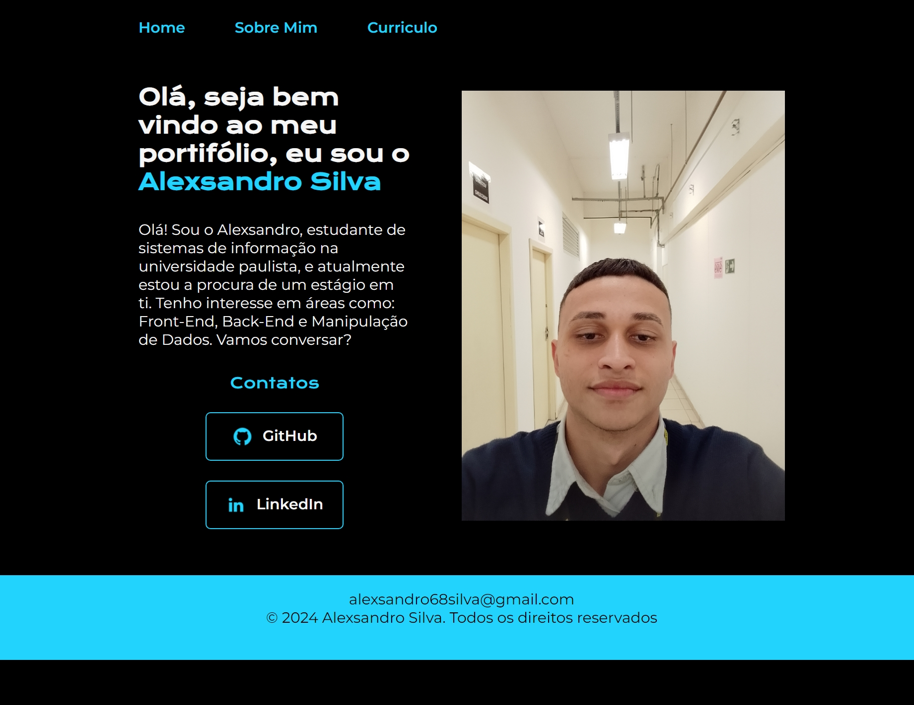

# Meu Portifólio

## Tecnologias Utilizadas

    
  
   

## Descrição

Este é o meu portfólio pessoal, desenvolvido para aprimorar meus conhecimentos em HTML e CSS, e me aprofundar nas práticas de desenvolvimento web. Este projeto é uma vitrine das minhas habilidades, experiências e formação, e também serve como uma carta de apresentação para potenciais empregadores e colaboradores.

## Pré-requisitos

Para acessar a versão online do portfólio, não há necessidade de configuração adicional. Basta seguir o link abaixo:

- **Link para o portfólio:** [Acesse o portfólio](https://portifolio-alexsandro-silvas-projects.vercel.app/)

Se você deseja rodar uma cópia local do portfólio, você precisará dos seguintes itens:

1. **Navegador Web:** Qualquer navegador moderno (Chrome, Firefox, Safari, Edge).
2. **Editor de Código:** Opcional, se você deseja fazer alterações no código-fonte. Eu recomendo um que eu utilizo que é o [VS Code](https://code.visualstudio.com/) mas pode ser outro editor de sua preferência.
3. **Git:** Opcional, se você deseja clonar o repositório. [Git](https://git-scm.com/) pode ser baixado e instalado.

## Contato

Para perguntas ou mais informações, entre em contato comigo:

- **Email:** alexsandro68silva@gmail.com
- **LinkedIn:** [Meu Perfil no LinkedIn](https://www.linkedin.com/in/alexsandro-silva-228836197/)

